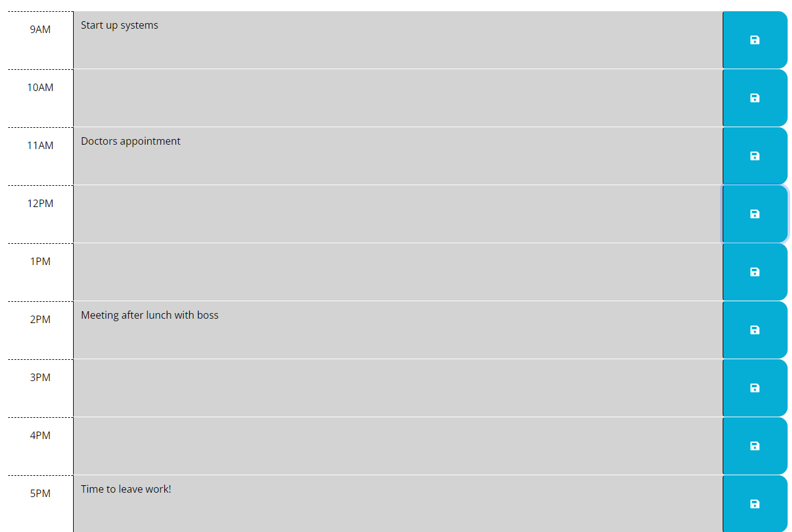

# Daily Planner

## Description

This is a fairly simple webpage that acts as a daily planner/scheduler. It was a great way to practice my skills using jQuery and Day.js 

## Usage

This webpage can by access by going to [this link.](https://timpyjoe.github.io/Daily-Planner)
Below is a screenshot of what the webpage might look like while it is being used.

To uses this webpage, all the user has to do is populate the given time blocks with things to do at that time. A gray block represents an hour that is in the past, a red block represents the current hour, and a green block represents future hours.

Upon entering something into a given block, the user can click the 'save' button to store the data in local storage. If the page is refreshed or closed and reopened, the data will be read from local storage and will repopulate the planner. The 'save' button must be clicked after any changes are made to the text area to update the local storage.
